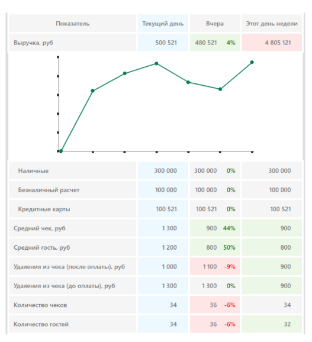

## Тестовое задание для Fronted-разработчика от компании Delta

Компания - [Delta](https://www.delta-ltd.ru/)

---

### Клонирование и запуск проекта

```bash
git clone https://github.com/npukojiucm/fin-table.git
cd fin-table
yarn    # or yarn install
yarn run dev
```
---


### Задание
Сверстать таблицу (как на картинке) - реактивно JS-фреймворком или вручную. Дизайн как на картинке.

При выборе (кликом) строки таблицы - появляется график с данными по этой строке

